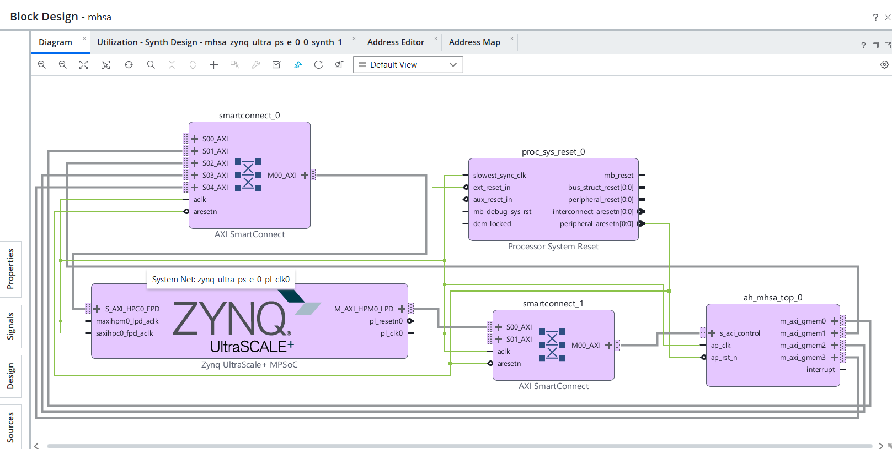
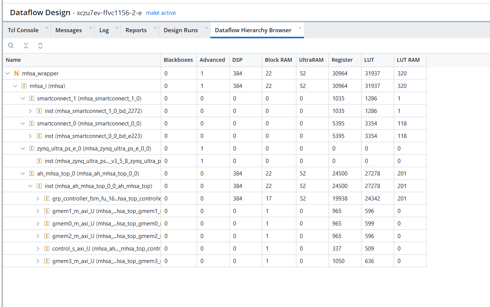
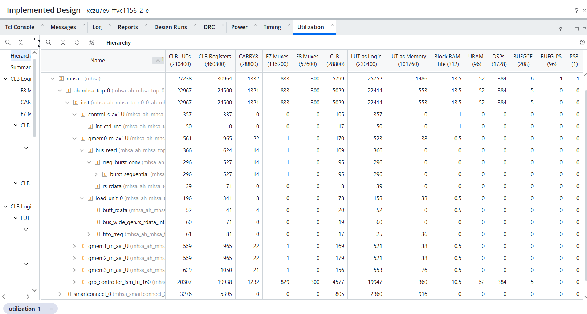
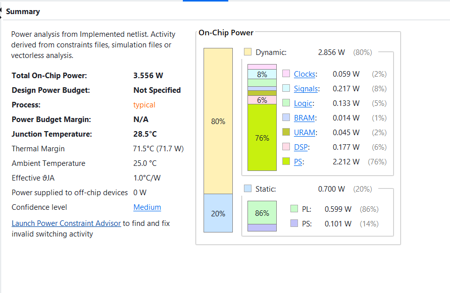
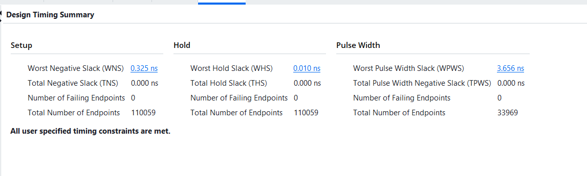

# ViT-Base/16 Multi-Head Self-Attention FPGA Accelerator

**Status:** ✅ Hardware implementation completed and validated on FPGA

A complete FPGA accelerator for the Multi-Head Self-Attention (MHSA) module of Vision Transformer (ViT-Base/16). This repository covers the full flow from HLS design through Vivado integration, bitstream generation, and hardware validation against a PyTorch reference model.

---

## Overview

Multi-Head Self-Attention is the most compute- and memory-intensive block in a Vision Transformer encoder. This project implements the MHSA module of **ViT-Base/16** (12 heads, hidden dim 768, 64 dims/head) as a synthesizable HLS kernel, packages it as a Vivado IP, and validates the resulting hardware output bit-for-bit / tolerance-checked against a PyTorch golden reference.

Key highlights:
- HLS C++ implementation of scaled dot-product attention across all 12 heads
- AXI4 master interfaces for streaming Q/K/V from DRAM and writing back the attention output
- Full Vitis HLS → Vivado IP packaging → bitstream flow, run end-to-end on real FPGA hardware
- Output validated against a PyTorch reference implementation, with generated validation reports

---

## Architecture

<!-- Embed the diagrams from docs/ -->



The design is organized as:
- **`mhsa_top`** — top-level kernel, exposes AXI4 master ports for Q, K, V, and output (`gmem_q`, `gmem_k`, `gmem_v`, `gmem_o`) plus an AXI4-Lite control interface (`control_s_axi`) for start/done/argument handshaking.
- **`attention_top`** — per-head scaled dot-product attention (`QK^T / sqrt(d_k)` → softmax → weighted sum with V).
- **`online_attention.h`** — an online/streaming softmax implementation, avoiding materializing the full N×N attention matrix in on-chip memory.
- **`pwl_exp.h`** — piecewise-linear approximation of the exponential function used inside softmax, trading a small accuracy delta for significantly cheaper hardware than a full exp core.

<!-- TODO: confirm/adjust this section against the actual pipeline structure in attention_top.cpp / mhsa_top.cpp -->

---

## Repository Structure

```
.
├── vit_base16/                  # HLS source (the accelerator itself)
│   ├── mhsa_top.cpp / .h        # Top-level MHSA kernel + AXI interfaces
│   ├── attention_top.cpp / .h   # Per-head attention core
│   ├── online_attention.h       # Streaming/online softmax attention
│   ├── pwl_exp.h                # Piecewise-linear exp() approximation
│   ├── attention_config.h       # Model/hardware configuration (dims, heads, precision)
│   ├── tb_mhsa_top.cpp          # C-simulation testbench
│   └── hls_config.cfg           # Vitis HLS project configuration
│
├── vivado_workspace/             # Vivado IP integration, block design, bitstream generation
│
├── docs/                         # Diagrams, validation scripts, and reports
│   ├── block_diagram.png
│   ├── datafllow_hirarchy.png
│   ├── hardware_utilization.png
│   ├── power_summary.png
│   ├── timing_summary.png
│   ├── mhsa_validation.py        # PyTorch vs. FPGA validation script
│   ├── mhsa_bd.pdf
│   ├── MHSA_12Head_Validation_Report (1).pdf
│   └── MHSA_FPGA_vs_PyTorch_Validation_Report.pdf
│
├── q.txt, k.txt, v.txt            # Input test vectors (Query / Key / Value)
├── golden_output.txt               # Reference (golden) MHSA output
├── golden_head_0.txt … golden_head_11.txt   # Per-head golden reference outputs (12 heads)
├── hls_config.cfg
├── vitis-comp.json
└── compile_commands.json
```

---

## Design Details

| Parameter | Value |
|---|---|
| Model | ViT-Base/16 |
| Number of heads | 12 |
| Hidden dimension | 768 |
| Per-head dimension | 64 |
| Softmax | Online/streaming softmax with PWL exp approximation |
| Top-level interfaces | AXI4 master (`gmem_q`, `gmem_k`, `gmem_v`, `gmem_o`), AXI4-Lite control |

<!-- TODO: fill in / correct — data type & precision (fixed-point width, e.g. ap_fixed<16,6>?), sequence length N, target clock frequency -->

---

## Build & Run

### 1. HLS simulation, synthesis, and co-simulation (Vitis HLS)
```bash
cd vit_base16
vitis_hls -f run_hls.tcl        # or: open the project via hls_config.cfg in Vitis HLS GUI
```
This runs:
1. **C simulation** — validates `mhsa_top` against `tb_mhsa_top.cpp` in software
2. **C synthesis** — generates RTL from the HLS source
3. **Co-simulation** — validates the generated RTL against the same testbench

### 2. IP packaging and Vivado integration
```bash
cd ../vivado_workspace
vivado -mode batch -source build_bd.tcl   # <-- update with actual script name
```
This packages the synthesized kernel as a Vivado IP, integrates it into a block design, and generates the bitstream.

### 3. Hardware validation
```bash
cd ../docs
python mhsa_validation.py
```
Compares the FPGA-produced attention output against a PyTorch reference implementation, using `q.txt` / `k.txt` / `v.txt` as inputs and `golden_output.txt` / `golden_head_*.txt` as the expected results.

<!-- TODO: confirm exact tcl script names and CLI flags used in your Vivado flow -->

---

## Validation Results

Validation was performed by feeding identical Q/K/V test vectors into both the PyTorch reference model and the FPGA implementation, and comparing outputs per-head and for the full concatenated result.

- Full methodology and numerical comparison: see `docs/MHSA_FPGA_vs_PyTorch_Validation_Report.pdf`
- Per-head (12-head) breakdown: see `docs/MHSA_12Head_Validation_Report (1).pdf`

### Hardware utilization, power, and timing

| | |
|---|---|
| Resource utilization |  |
| Power summary |  |
| Timing summary |  |

<!-- TODO: pull the key numbers (LUT/FF/BRAM/DSP %, total power, achieved Fmax/latency) out of these images into a short summary table here -->

---

## Requirements

- Xilinx Vitis HLS / Vivado <!-- TODO: version, e.g. 2023.2 -->
- Target FPGA board / part <!-- TODO: e.g. ZCU104, Alveo U250, part number -->
- Python 3.x + PyTorch (for `mhsa_validation.py`)

---

## License

<!-- TODO: add a license (MIT/Apache-2.0/etc.) or state "All rights reserved" -->

## Author

Navneet Kumar Tiwari
